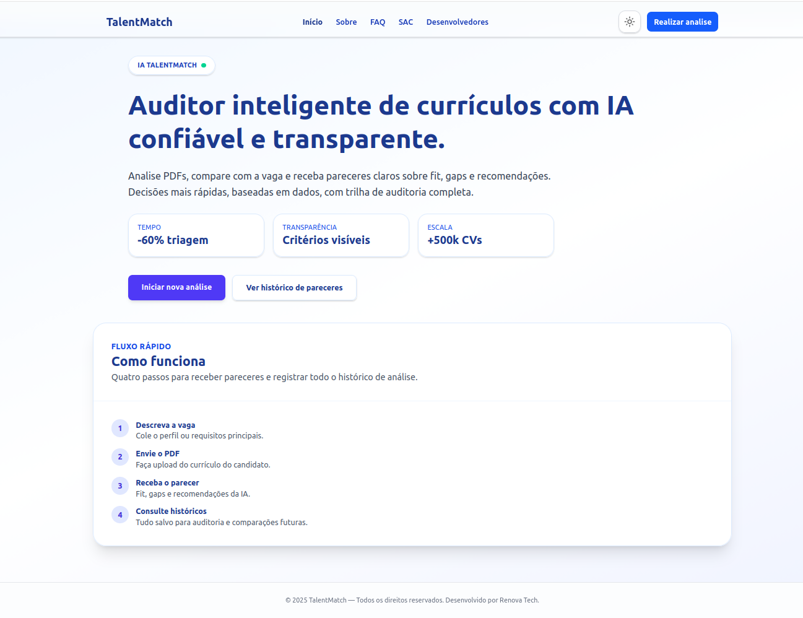
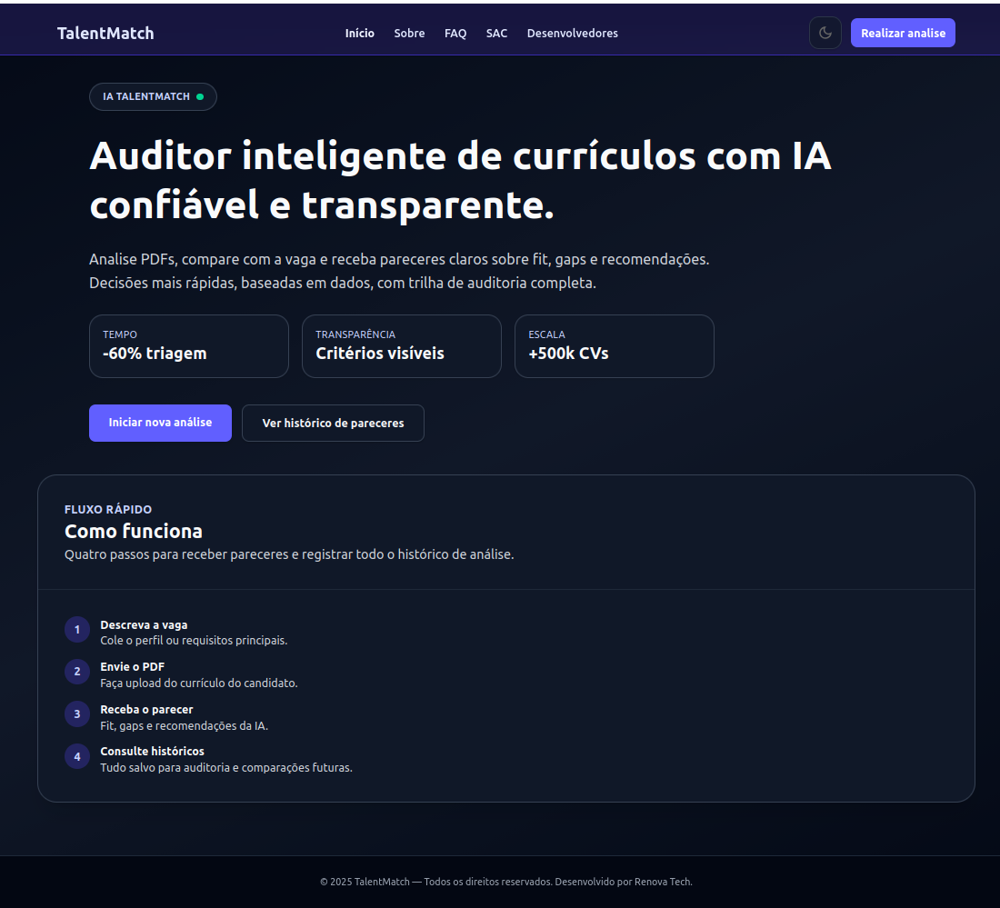
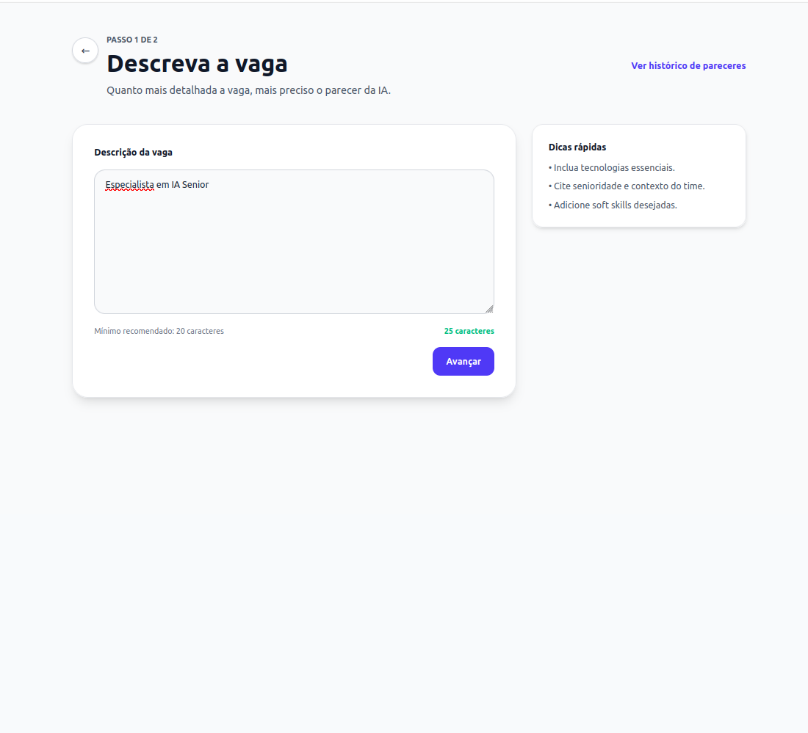
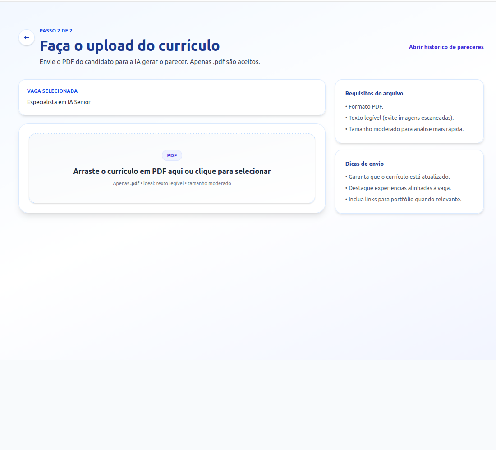
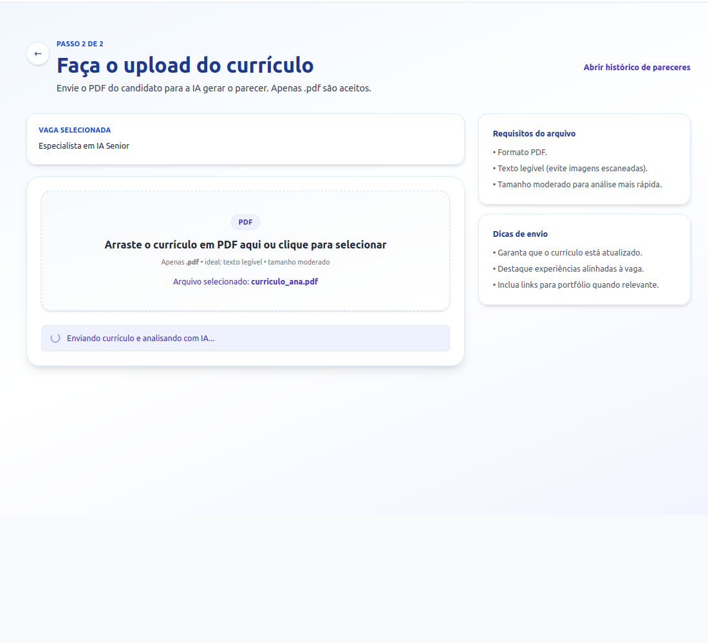
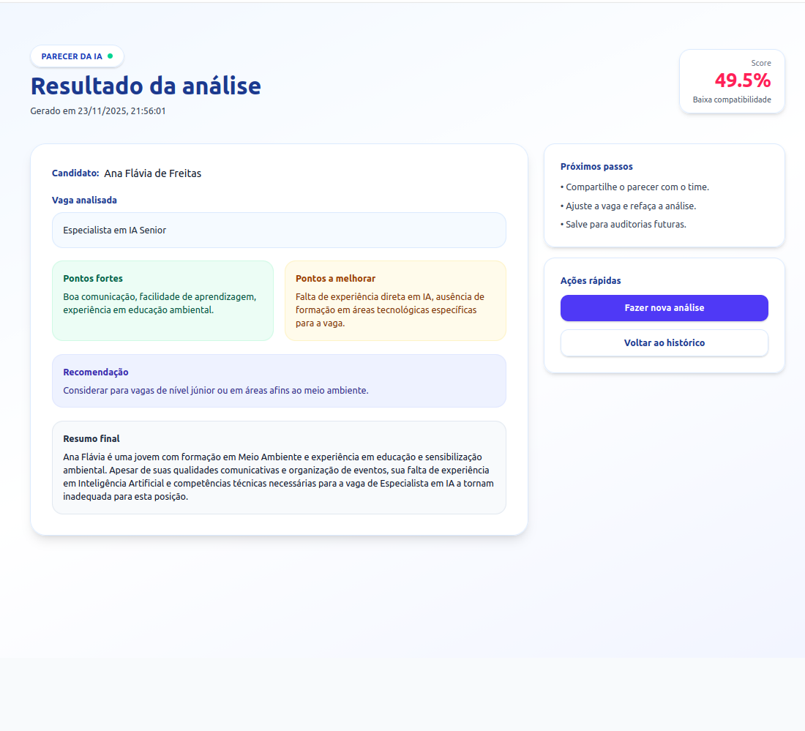
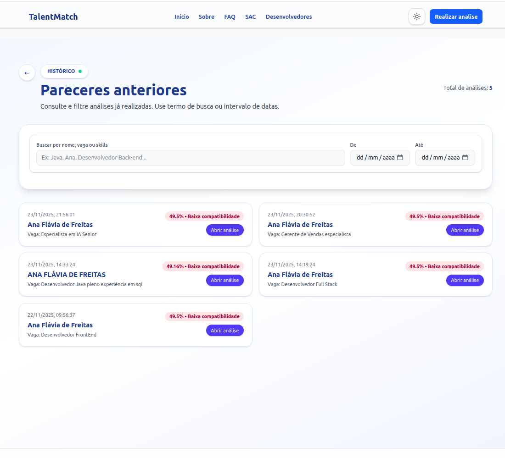

# TalentMatch – Auditor de Currículos
Plataforma web para analisar currículos com IA, comparar com requisitos de vaga e gerar pareceres claros, com histórico e tema claro/escuro.

- **Status do projeto:** Em desenvolvimento (MVP funcional)

## DEPLOY

https://talentmatch-ia.vercel.app/

## Sumário
- [Sobre o Projeto](#sobre-o-projeto)
- [Tecnologias Utilizadas](#tecnologias-utilizadas)
- [Instalação](#instalação)
- [Como Usar](#como-usar)
- [Estrutura de Pastas](#estrutura-de-pastas)
- [Endpoints ou Rotas Principais](#endpoints-ou-rotas-principais)
- [Autores e Créditos](#autores-e-créditos)
- [Screenshots / Demonstração](#screenshots--demonstração)
- [Contato](#contato)

## Sobre o Projeto
Aplicação front-end que permite:
- Descrever uma vaga e enviar um currículo em PDF para análise.
- Visualizar score de compatibilidade gerado por modelo de Machine Learning, pontos fortes e recomendações geradas por IA.
- Consultar histórico de pareceres anteriores.
- Navegar por páginas institucionais (Sobre, FAQ, Desenvolvedores, SAC).
- Alternar entre tema claro e escuro.

## Tecnologias Utilizadas
- React + TypeScript
- Vite 
- React Router DOM 
- Tailwind CSS 
- React Hook Form + Zod
- Python
- API OPENAI

## Instalação
```bash
git clone https://github.com/GLOBAL-SOLUTION-1-SEM-2025-ADS/talent-match-gs.git
cd app_talent_match
npm install
```

## Como Usar
```bash
# ambiente de desenvolvimento
npm run dev

# build de produção
npm run build
npm run preview
```
Depois de rodar `npm run dev`, acesse o endereço exibido no terminal (por padrão, http://localhost:5173).

## Estrutura de Pastas
```
src/
  components/      # Header, Footer, ThemeToggle, cards e UI reutilizáveis
  context/         # ThemeContext (tema claro/escuro)
  layouts/         # Layouts de página
  pages/           # Páginas institucionais e fluxos do app (vaga, upload, histórico, resultado)
  routes/          # Definição das rotas com React Router
  utils/           # Helpers e storage local
  types/           # Tipagens compartilhadas
```

## Endpoints ou Rotas Principais
- `/` – Home
- `/about` – Sobre
- `/faq` – Perguntas frequentes
- `/sac` – Contato/Suporte
- `/developers` – Equipe do projeto
- `/vaga` – Descrever vaga e iniciar análise
- `/upload` – Upload do currículo
- `/historico` – Listagem de pareceres já gerados
- `/analise/:id` – Detalhe de um parecer específico

## Autores e Créditos
- Ana Flavia de Freitas – [LinkedIn](https://www.linkedin.com/in/ana-fl%C3%A1via-de-freitas/) | [GitHub](https://github.com/anafreitas-br)
- Luis Guilherme Borges Silva – [LinkedIn](https://www.linkedin.com/in/luis130505/) | [GitHub](https://github.com/LuisGdev13)

## Screenshots (telas do app) / Demonstração
- Home (tema claro)  
  
- Home (tema escuro)  
  
- Seleção de vaga e parâmetros  
  
- Upload de currículo e status  
    
  
- Resultado da análise de IA  
  
- Histórico com filtros  
  

## Contato
- Suporte/Parcerias: rm565559@fiap.com.br
- Issues e sugestões: abra uma issue no repositório GitHub.
